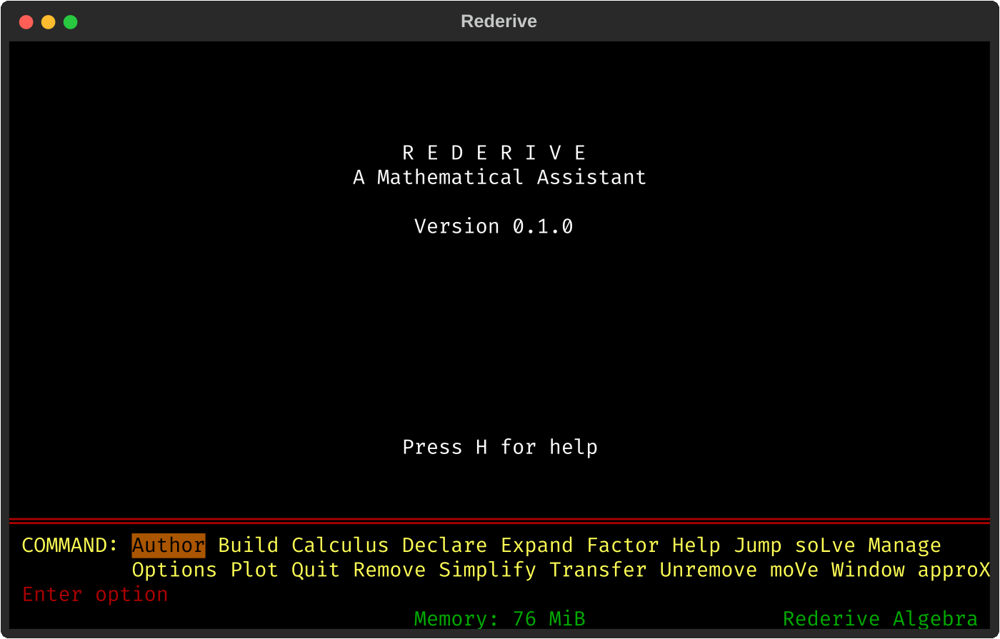

# Rederive - a friendly mathematical assistant

Rederive is a from-scratch reimplementation of Derive, the classic DOS computer algebra
system. Written on top of [SymPy](https://www.sympy.org/en/index.html), it simplifies,
solves, expands and plots a wide range of mathematical expressions and equations, both
symbolically and numerically, through an interactive menu-driven interface. What sets it
apart from SymPy in a Jupyter notebook is how it treats the user: Rederive reads `ax+b` or
`sinx` the way a mathematician would, and displays every result nicely typeset right in
the terminal. The UI, inherited from Derive, is tiny and opinionated, but discoverable and
built for humans.

<p align="center"></p>

## Motivation

Derive came out of Honolulu in 1988 and was the first computer algebra system that ran on
machines mortals could afford. It fit on a floppy, worked on a 286 with half a megabyte of
memory, and quietly took over maths classrooms across Europe. (I was introduced to it in a
Croatian classroom around 1992.) It was cheap, famously close to bug-free, and you could
learn to use it in minutes. More importantly, its ease of use and responsiveness made math
fun in ways that are not quite matched by modern and more advanced programs, nor even by
LLMs. Derive was discontinued in 2007 after having been acquired by Texas Instruments.

Rederive aims to bring the experience back on modern foundations. The important pieces
have long existed - Python as the lingua franca of math and science,
[SymPy](https://www.sympy.org/en/index.html) for symbolic math,
[Textual](https://textual.textualize.io/) for TUIs. What remained is assembling them into
a user-friendly CAS.

Much like Derive, Rederive runs in a terminal. It follows the look&feel of the original,
but adapts to the 21st century where appropriate. The display is Unicode rather than code
page 437, and everything is laid out for the terminal's actual size instead of an 80x25
screen. The mouse and scroll wheel work, plots use OpenGL, it uses the system clipboard,
file names tab-complete, and the line editor follows Emacs conventions.

## Installing

Rederive ships as a single self-contained binary for Linux, macOS and Windows; none of
them needs Python. On Linux and macOS, one line installs it:

```
curl -LsSf https://github.com/hniksic/rederive/releases/latest/download/install.sh | sh
```

See [INSTALL.md](INSTALL.md) for Windows, for running a binary without installing it, and
for running from source.

## Usage

Press enter to input an expression, and then <kbd>s</kbd> to Simplify it, <kbd>l</kbd>
to soLve it, etc. For example typing in the expression:

```
((ax+b)^2 - (ax-b)^2) / ((cx+d)^2 - (cx-d)^2)
```

displays it as:

```
         2            2
(a·x + b)  - (a·x - b)
─────────────────────────
         2            2
(c·x + d)  - (c·x - d)
```

and pressing <kbd>s</kbd> simplifies it to:

```
 a·b
─────
 c·d
```

Calculus goes through a small menu. Author `#e^(-x^2)`, press <kbd>c</kbd> for Calculus
and <kbd>i</kbd> for Integrate, and enter the limits `0` and `inf`:

```
 ∞
╭      2
│   - x
╯  ê     dx
 0
```

Pressing <kbd>s</kbd> answers:

```
 √π
────
  2
```

## Plotting

Highlight an expression, press <kbd>p</kbd> for Plot and <kbd>p</kbd> again, and it is
drawn in a plot window.

Rederive works out what an expression is a plot of and draws it accordingly:

* a curve for `SIN(x)/x`, 
* one curve per element of a vector like `[x, x^2, x^3]`,
* a parametric curve for `[3SIN(3t), 3SIN(4t)]`,
* a polar curve for `r = f(θ)` in a window switched to polar,
* the zero contour for an equation like `x^2 + y^2 = 9`,
* a shaded area for an inequality, 
* points for a matrix of numbers, and
* a shaded surface for anything in two variables. 

## For the math nerds

Mathematically, Rederive covers exact rational and arbitrary-precision arithmetic, and
algebra over polynomials, rational functions, and elementary transcendental expressions.
Equations can be solved exactly or approximately. The calculus menu offers limits,
derivatives, Taylor polynomials, symbolic integration, and closed forms for sums and
products (`Σ 1/k^2` from 1 to ∞ is `π²/6`). Vectors and matrices are supported too,
including symbolic linear algebra, eigenvalues, and vector calculus. In the original
Derive, loadable utility files extended the core with ordinary differential equations,
recurrence equations, special functions (Bessel, elliptic, hypergeometric, zeta, and
others), number theory, and unit conversion. These utilities, [still
found](https://archive.org/details/derive314cas) in Internet archives, work in Rederive. A
small functional programming language based on conditionals, iteration, and recursion lets
users define their own functions.

Its chief strength is the care behind its simplifier. The goal is a "sufficiently simple"
result, one with no superfluous variables, roots, or reducible degrees, while transforming
the input as little as necessary: `x^2 - (x + (y+1)^50)·(x - (y+1)^50)` simplifies to
`(y + 1)^100`, not to a degree-100 polynomial, because expressions are not needlessly
expanded or forced over common denominators. It is also mathematically conservative, using
an identity only where it provably holds. Variables are real by default, so `√(x^2)` is
`|x|`, but `ln(x^2 - x) - ln(x)` is only rewritten to `ln(x - 1)` after the user declares
x positive. Users control behavior through declarations of variable domains, branch
selection for multivalued functions, and switchable exact, approximate, and mixed
precision modes.

Rederive is exact all the way down - there is no floating point anywhere, even in
approximation. Approximating to n digits replaces a value by the simplest rational that
matches it to those digits (π to six digits is 355/113), and everything computed from it
afterwards is again exact. The only inexactness is the one you request.

Compared with large systems such as Mathematica or Maple, Rederive's coverage is narrower.
Exact polynomial solving works only for equations reducible to quartics, and numeric
root-finding requires a user-supplied search interval. Much functionality lives in utility
files rather than in the core. The programming language is minimal, with no local
variables, explicit loops, or data structures beyond vectors and matrices, so libraries
introducing advanced polynomial algebra or sophisticated definite integration are out of
reach. If you need that, you should probably turn to SymPy (or Mathematica) directly.
Within its chosen scope, however, Rederive strives to be small and dependable. That
trade-off defined the original: keep the system simple, but powerful enough to be useful,
especially in the classroom.

## License

Rederive is distributed under the terms of the MIT license.  See [LICENSE](LICENSE) for
details.  Contributing changes is assumed to signal agreement with these licensing terms.
