# Rederive - the friendly mathematics system

Rederive is a from-scratch reimplementation of Derive, the classic DOS computer algebra
system. Implemented on top of SymPy, it does what you expect of a computer algebra system:
exact arithmetic, simplification, factoring, equation solving, calculus. What sets it
apart is friendliness: Rederive reads `ax+b` or `sinx` the way a mathematician writes
them, and displays every result nicely typeset in the terminal. The UI is small and
opinionated, but discoverable and humane.

<p align="center"></p>

## Motivation

Derive came out of Honolulu in 1988 and was the first computer algebra system that ran on
machines mortals could afford. It fit on a floppy, worked on a 286 with half a megabyte of
memory, and quietly took over maths classrooms across Europe. (I first saw it around 1992
in a dusty classroom in Croatia.) It was cheap, famously close to bug-free, and you could
learn to use it in minutes. More importantly, its ease of use and responsiveness made math
fun in ways that are not quite matched by modern and more advanced programs, nor even by
LLMs.  The original Derive was discontinued in 2007 after having been acquired by Texas
Instruments.

Rederive aims to bring the experience back on modern foundations. The important pieces
have long existed - Python, [SymPy](https://www.sympy.org/en/index.html) for symbolic
math, and [Textual](https://textual.textualize.io/) for building a TUI. What remained is
assembling them into a user-friendly CAS.

Much like Derive, Rederive runs in a terminal. It follows the look&feel of the original,
but adapts to the 21st century where appropriate - Rederive integrates with the system
clipboard, reads mouse clicks and the scroll wheel, and uses Unicode rather than ancient
code pages.

## Running and installing

### Trying it out

Download one file and run it. It needs no Python and installs nothing, and deleting the
file is the whole of uninstalling.

**Linux:**

```
curl -LO https://github.com/hniksic/rederive/releases/latest/download/rederive-linux-x86_64
chmod +x rederive-linux-x86_64
./rederive-linux-x86_64
```

**macOS (Apple Silicon):**

```
curl -LO https://github.com/hniksic/rederive/releases/latest/download/rederive-macos-arm64
chmod +x rederive-macos-arm64
./rederive-macos-arm64
```

**Windows:**

```
curl.exe -LO https://github.com/hniksic/rederive/releases/latest/download/rederive-windows-x86_64.exe
.\rederive-windows-x86_64.exe
```

The download goes through `curl` on purpose. Rederive's binaries are not code-signed -
signing certificates cost money that a hobby project has not spent - and both macOS and
Windows refuse to run unsigned programs that a *browser* downloaded. The refusal is
about the mark the browser attaches, not about the file: `curl` attaches no mark, so a
binary fetched this way simply runs. (`curl.exe` ships with Windows 10 and later.)

If you download through a browser anyway, you can undo the mark:

- macOS: `xattr -d com.apple.quarantine rederive-macos-arm64`, or open System Settings →
  Privacy & Security and press **Open Anyway** after the first refusal.
- Windows: on the SmartScreen warning, choose **More info** → **Run anyway**.

On Windows, run Rederive in [Windows
Terminal](https://aka.ms/terminal) rather than the old console window, which has neither
the colours nor the mouse support Rederive expects.

### Installing it

The single file above unpacks itself into a temporary directory every time it starts,
which costs about a tenth of a second. Installing avoids that, and puts `rederive` on
your `PATH` so it starts by name from anywhere.

**Windows:** download and run
[`rederive-setup.exe`](https://github.com/hniksic/rederive/releases/latest/download/rederive-setup.exe).
It is an ordinary installer - next, next, finish - and it adds Rederive to your `PATH`
and to Add/Remove Programs, where uninstalling it undoes both. SmartScreen warns once
before it starts, the installer being unsigned; choose **More info** → **Run anyway**.

**Linux and macOS:**

```
curl -LsSf https://github.com/hniksic/rederive/releases/latest/download/install.sh | sh
```

That unpacks Rederive into `~/.local/share/rederive`, links it into `~/.local/bin`, and
says so if that directory is not on your `PATH`. Options go through `sh` - `sh -s --
--prefix /opt --bin /usr/local/bin` - and `sh -s -- --uninstall` removes it again.

### Running from source

1. Download Rederive with `git clone https://github.com/hniksic/rederive`, or [grab the
   ZIP](https://github.com/hniksic/rederive/archive/refs/heads/master.zip) and unpack it.
2. Install [uv](https://docs.astral.sh/uv/getting-started/installation/).
3. In the `rederive` directory, run `uv run rederive`.

## Usage

Press enter to input an expression, and then <kbd>s</kbd> to Simplify it, <kbd>l</kbd>
to soLve it, etc. For example typing in the expression:

```
((ax+b)^2 - (ax-b)^2) / ((cx+d)^2 - (cx-d)^2)
```

displays it as:

```
         2            2
(a·x + b)  - (a·x - b)
─────────────────────────
         2            2
(c·x + d)  - (c·x - d)
```

and pressing <kbd>s</kbd> simplifies it to:

```
 a·b
─────
 c·d
```

Calculus goes through a small menu. Author `#e^(-x^2)`, press <kbd>c</kbd> for Calculus
and <kbd>i</kbd> for Integrate, accept the offered expression and variable, and enter
the limits `0` and `inf`:

```
 ∞
╭      2
│   - x
╯  ê     dx
 0
```

Pressing <kbd>s</kbd> answers:

```
 √π
────
  2
```

## For the math nerds

Rederive is a computer algebra system of the classical kind: a worksheet of expressions
and a handful of commands that transform them - Simplify, Expand, Factor, soLve, the
calculus menu. It works over rationals, radicals and complex numbers, polynomials and
rational functions, the elementary transcendental functions, and vectors and matrices; the
calculus commands do derivatives, integrals, limits, Taylor expansions, and sums and
products both definite and indefinite (`Σ 1/k^2` from 1 to ∞ is π²/6). All arithmetic is
exact (no floating point anywhere), including approximation: approximating to n digits
replaces a value by the simplest rational that matches it to those digits, so π to six
digits is 355/113, and everything computed from it afterwards is again exact. The only
error is the one you asked for.

Simplification is conservative. It removes what is superfluous but otherwise leaves the
expression the way you wrote it - `x^2 - (x + (y+1)^50)·(x - (y+1)^50)` simplifies to
`(y + 1)^100`, not to a degree-100 polynomial - and how far Expand and Factor go is
yours to choose, up to factoring over radicals and complex numbers. An identity is used
only where it provably holds: variables are real by default, so `√(x^2)` is `|x|`;
`SIN(n·π)` becomes 0 once n is declared an integer; `|x| + |x - 1|` becomes 1 once x is
confined to (0, 1). Multivalued functions take their principal branches, unless you
switch to real or any-branch mode.

What it does, it does predictably: Simplify and Solve are total, so an integral the
engine cannot do comes back as an integral, an equation it cannot crack comes back as an
implicit relation, and `1/0` is `±∞` rather than an error. The weaknesses are classical
too: a definite integral is evaluated straight through an interior singularity
(`∫ dx/x^2` over [-1, 1] gives -2 unless you split it at the pole yourself), and
declared intervals are consulted only as far as linear reasoning reaches.

## License

Rederive is distributed under the terms of the MIT license.  See [LICENSE](LICENSE) for
details.  Contributing changes is assumed to signal agreement with these licensing terms.
