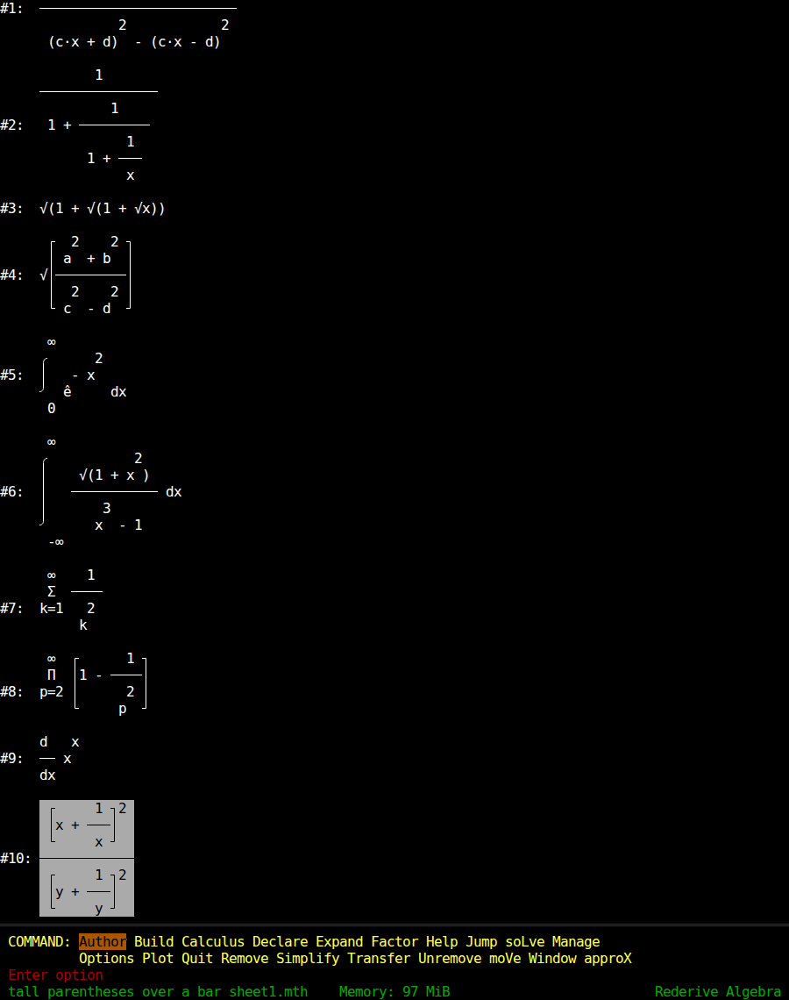
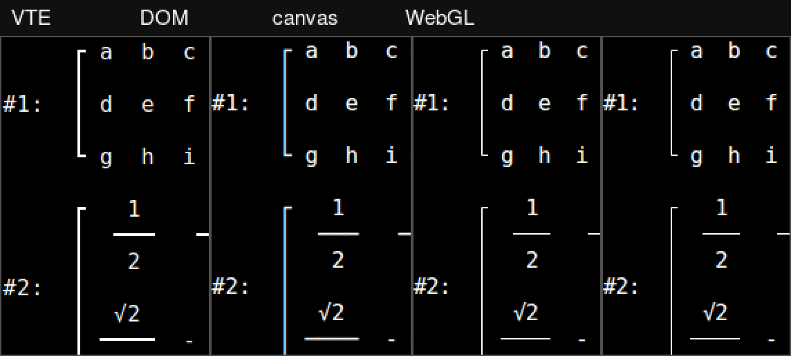

# Web demo, stage 0: what the three spikes found

Stage 0 of the browser plan is three questions that can kill or reshape everything after
them. This is what asking them produced, measured on 6 August 2026. The spike code was
thrown away, as the plan says; what follows is all that survives of it.

Everything below was measured on one machine and in two browsers, and nothing below is
an estimate. Where a thing could not be measured it says so and says why.

**The machine.** Intel Core Ultra 7 258V, 8 cores, 30 GB, Linux 6.14. **The browsers**,
all four headless: the machine's own **Chromium 150.0.7871.128** and **Firefox 153.0.3**,
both snaps, which is where the timings come from; and the builds **Playwright** ships,
**Chromium 151.0.7922.34** and **Firefox 153.0**, which is where the rendering comparisons
come from and which turned out to be no good for timing at all - see 0b. **Python** 3.13
with sympy 1.14.0 for the native comparisons, which is what `uv run` gives the repository
today.

## The verdicts, first

* **0a - the glyphs are fine, and this risk can be closed.** Every character the display
  can put on a screen is one cell wide in xterm.js and one cell wide in Rich, and the
  whole screen the real program writes lands in xterm.js's buffer character-for-character
  identical to a third emulator's. All three renderers draw it acceptably; canvas and
  WebGL draw it better than the DOM one, and are pixel-identical to each other.
* **0b - the cost of entry is about a tenth of what the plan budgeted, and Esc costs two
  thirds of a second.** On the `pyc` channel, first answer in **0.83 s** (Chromium) and
  **0.89 s** (Firefox), and an abort-and-respawn in about **0.65 s** in both. sympy runs
  at two to three times native speed. The plan's 8-15 second loading screen, and its
  contingency of a hot-standby worker, are both answers to problems that are not there -
  **provided the build uses the `pyc` channel**, which is four times faster than the
  default one for 4.7 MB more.
* **0c - two libraries fail, and the failure comes before any import does.** psutil has
  no WebAssembly wheel at all, so installing the wheel does not even resolve under
  Pyodide. Behind that, six modules fail to import and every one of them fails on psutil
  or pyperclip, and **nothing at all hides behind those two**. Splitting the dependencies
  is not a nicety; it is a precondition.

## 0a. Glyph and width fidelity

### How it was asked

The dump is real. `python -m rederive SHEET.mth` was run on a pseudo-terminal of 100
columns by 60 rows with `TERM=xterm-256color`, and every byte the program wrote was
captured. Two worksheets were authored for it: one of nested fraction bars, nested
roots, a definite integral, a tall integral over a fraction, a sum, a product, a
derivative and a pair of tall parenthesised powers; one of a 3x3 matrix, a matrix of
fractions, absolute-value rails, the ten Greek letters and the constants, the relation
glyphs and the dot product, `ê` and `î`, the limit arrow and a script tower. A third
dump was produced by calling `display.render` directly, because two characters the
inventory holds - the compressed format's half-bar `╴` and the `═` of the frame rule -
do not appear in a default-format worksheet.

Those dumps were fed to `term.write()` on a bare xterm.js page - **@xterm/xterm 6.0.0**
with **addon-unicode11 0.9.0**, **addon-webgl 0.19.0** and **addon-canvas 0.7.0**, from
npm - at 100x60, DejaVu Sans Mono 16px, under each of the three renderers in each of the
two browsers. The same dumps were fed to a real terminal for comparison: **VTE 2.91**,
the widget gnome-terminal is built on, in an offscreen GTK window.

### Widths agree, exactly

Two questions, asked separately.

The per-character one: 49 characters were put to both Rich's `cell_len` and xterm.js's
own width service. Everything `display/glyphs.py` can emit - `· ∙ π ∞ ° ê î`, the ten
Greek letters, `≤ ≥ ± ─ ╴ √ Σ Π → ↓ ┌ │ └ ┐ ┘ ╭ ╯` and the frame's `═` - plus `⌠` and
`⌡`, which the plan named as suspect and which `glyphs.py` deliberately does not use,
plus a control group of ASCII. **All 49 are one cell in both, in both browsers, with the
unicode11 addon on and with it off.** None of them is an ambiguous-width character in
either table, so there is nothing here for the two sides to disagree about.

That means the unicode11 addon is not what saves this display. It should still be loaded
in stage 3 - it is what keeps a future glyph from shearing a line - but the agreement
does not depend on it.

The whole-screen one, which is the stronger test: after each dump was written, xterm.js's
buffer was read back row by row and compared against the same dump run through a third
emulator, `pyte`. **All 60 rows identical, in all twelve combinations** - two browsers,
three renderers, two dumps. Not one column of drift anywhere on the screen, including the
status line, the command band and the window frame. Three independent implementations of
a terminal - Rich writing, xterm.js reading, pyte checking - put every character in the
same column.

### It looks right



That is the WebGL renderer in Chromium, showing what the real program wrote: the
integral rails, the sum and product signs, the fraction bars, the roots and the tall
parenthesised powers. It is a screenshot, not a mock-up.

The renderers differ, and the difference is smaller than the plan feared:



* **DOM** takes the box-drawing characters from the page font. DejaVu Sans Mono's are
  heavy, and because the DOM renderer uses a fractional cell advance (9.63 px against
  the canvas renderers' 9.0, so 100 columns come to 963 px rather than 900) they are
  drawn with subpixel antialiasing and carry visible colour fringes. The rails still
  join seamlessly at every height. Acceptable, and the worst of the three.
* **canvas** and **WebGL** substitute xterm.js's own hand-drawn glyphs, which is exactly
  the substitution the plan was worried about - and it is an improvement. They are drawn
  to the cell, so the joins are exact, the stroke weight matches the fraction bars, and
  there is no fringing. The integral rail `╭ │ ╯` reads as an integral sign, the matrix
  rails as brackets, the half-bar as a half-width bar.
* **VTE**, the real terminal, sits between them: it draws its own box glyphs too, heavier
  than xterm.js's and lighter than the font's.

Canvas and WebGL are not merely similar: their screenshots are **pixel-identical**, RMSE
0 in every one of the six pairs taken. They share the glyph-drawing code and differ only
in how the result reaches the screen, so the fallback costs nothing in appearance. Across
browsers the same renderer differs slightly - RMSE 0.010 of full scale for canvas and
WebGL, 0.026 for DOM, all of it antialiasing.

**Verdict: use WebGL, fall back to canvas, and do not use the DOM renderer.** The plan
already says to load the WebGL addon; the only addition is that canvas rather than DOM
should be the fallback when a WebGL context cannot be had, since the DOM renderer is the
one that looks unlike a terminal.

### What 0a did not settle

* Only the *output* half. No keystroke, no mouse report and no resize crossed the
  boundary in either direction; `XTermParser` was not exercised at all. The plan's claim
  that the input half is sound rests on pyTermTk, not on anything measured here.
* Only one font. DejaVu Sans Mono was used throughout; a user whose browser resolves
  `monospace` to something else was not tested, and neither was the case where the font
  is missing entirely and the DOM renderer has nothing to fall back on.
* Only at one size, one grid and one colour scheme, and with no scrollback and no
  selection.
* The compressed format's `╴` was rendered by calling the display layer directly, not by
  switching the running program's `DisplayFormat` option. What was checked is that
  xterm.js draws the character the layer emits.

### A packaging note for stage 3

`@xterm/addon-canvas@0.7.0` declares a peer dependency on `@xterm/xterm@^5.0.0` while the
current xterm is 6.0.0, so npm warns on install. It loaded and rendered correctly anyway,
in both browsers. Worth knowing before someone reads the warning as a blocker.

## 0b. Cost of entry

### The shape of the harness

A page that spawns a Web Worker, boots Pyodide in it with `loadPyodide({packages:
['sympy']})`, imports sympy, and answers requests over `postMessage` - the stage 3 design
in miniature. Both channels were measured in both browsers: the default `full` one and
the precompiled `pyc` one. The Playwright runs took each channel twice more, served from
this machine over `python -m http.server` and from `cdn.jsdelivr.net`, cold and warm; the
system-browser runs are local only.

**Pyodide 314.0.3**, which is the current release and carries **Python 3.14.2, sympy
1.14.0, mpmath 1.4.1 and numpy 2.4.3**. This matters: the version `pyodide-build 0.39`
pairs with, 0.29.4, ships **sympy 1.13.3**, and the package requires `sympy>=1.14`.
Pyodide 314 satisfies the requirement out of the box; 0.29.4 would mean installing sympy
from PyPI and losing the precompiled wheel.

One thing broke immediately and is worth carrying forward: **Pyodide 314 refuses to load
in a classic Web Worker.** `importScripts` gets `Error: Classic web workers are not
supported`. The worker must be `new Worker(url, {type: 'module'})` and must reach the
runtime through `await import(indexURL + 'pyodide.mjs')`. Stage 3 should assume a module
worker from the start.

### Bytes

Measured with `curl --compressed` against the CDN, which is what a browser actually
transfers:

| | `full` | `pyc` |
| --- | ---: | ---: |
| `pyodide.mjs` + `pyodide.asm.mjs` | 0.27 MB | 0.27 MB |
| `pyodide.asm.wasm` | 3.44 MB | 3.44 MB |
| `python_stdlib.zip` | 2.50 MB | 3.74 MB |
| `pyodide-lock.json` | 0.02 MB | 0.02 MB |
| sympy wheel | 4.12 MB | 7.29 MB |
| mpmath wheel | 0.43 MB | 0.69 MB |
| **total** | **10.8 MB** | **15.5 MB** |

The plan's "about 4.7 MB more over the wire" for the `pyc` channel is exactly right:
4.68 MB. numpy is not in that total - it is another 2.88 MB on the default channel and
2.96 MB on `pyc`, and is only needed once plotting arrives. Note that numpy is the one
package the `pyc` channel does not shrink the load time of: it is a compiled extension,
so its wheel is nearly the same on both channels.

**Uncompressed, the same files are 16.9 MB and 46.7 MB.** jsdelivr serves them
compressed; `python -m http.server` does not. Whatever hosts the built demo must
compress, or the `pyc` channel costs three times what the table says. That is a stage 3
and stage 7 requirement, not a detail.

### Two sets of browsers, and why both are here

Every timing here was taken twice: in the builds Playwright ships, and in the machine's
own Chromium 150 and Firefox 153.0.3, both snaps, run headless against a page that
measures itself and posts its answers back to a small local server. That was meant as a
cross-check and turned into one of 0b's findings, because the two disagree wildly:

| first answer, `pyc` channel, served locally | Playwright build | system browser |
| --- | ---: | ---: |
| Chromium | 1.54 s | **0.83 s** |
| Firefox | 2.81 s | **0.89 s** |

| first answer, default channel, served locally | Playwright build | system browser |
| --- | ---: | ---: |
| Chromium | 5.25 s | **3.35 s** |
| Firefox | 22.1 s | **3.80 s** |

**Playwright's Firefox executes WebAssembly several times slower than a real Firefox**,
and its Chromium is about twice as slow as a real one. The effect is consistent across
every case and every repetition. Take from this that **a Playwright smoke test - which
stage 7 plans to add to CI - must not be used to time anything**, and that the numbers
below are the system browsers'.

### Seconds to a usable prompt

The whole trip as a user experiences it: from the page asking for a worker to an answer
computed in Python arriving back on the main thread. Headless, served from this machine
over `python -m http.server`.

| | Chromium 150 | Firefox 153 |
| --- | ---: | ---: |
| default channel | 3.35 s | 3.80 s |
| **`pyc` channel** | **0.83 s** | **0.89 s** |

Where the time goes:

| | `loadPyodide` with sympy | `import sympy` |
| --- | ---: | ---: |
| Chromium, default | 1.46 s | 1.87 s |
| Chromium, `pyc` | 0.56 s | 0.24 s |
| Firefox, default | 1.56 s | 2.12 s |
| Firefox, `pyc` | 0.52 s | 0.28 s |

**The plan's 8-15 second budget is roughly ten times too pessimistic**, and its warning
that SymPy Live tells its users 15-30 seconds describes a different world. One second to
a working sympy is a different product from fifteen; the loading screen stage 7 plans to
write about a long wait may not have a long wait to write about. The plan's cold-start
paragraph - 2.8 s in Firefox and 5.0 s in Chrome for the default channel, 1.3 / 1.7 s
for `pyc` - should be treated as superseded by the table above.

**The `pyc` channel is not a tuning knob, it is the design.** Four times faster in both
browsers for 4.7 MB more, and it is the difference between under a second and around
three and a half. The plan defers this decision to stage 7; on this evidence it should
be made in stage 3, with the default channel kept only as a fallback for a Pyodide
release that has no `pyc` build.

**Cold and warm are the same number** whenever the files are near. Measured in the
Playwright builds, which is where the cold/warm and CDN comparisons were taken, a warm
profile saved nothing at all when serving locally (5.25 s cold against 5.44 s warm for
Chromium's default channel) and saved 1.8 s when serving from jsdelivr. The cost is
compiling Python and building sympy's module objects, not transfer. Serving from
jsdelivr rather than from this machine cost Chromium 0.8 s cold on the default channel
and 1.9 s on `pyc`, which is the wire and nothing else.

One caveat on the system-browser numbers: each browser ran the default channel and then
the `pyc` channel on the same profile, so the runtime files the two channels share -
`pyodide.asm.wasm` above all - were already in the cache for the `pyc` run. Over
loopback that is worth tens of milliseconds, not more.

### Seconds per Simplify

The representative case is the README's, `((a·x+b)² - (a·x-b)²)/((c·x+d)² - (c·x-d)²)`
through `sympy.simplify`, answering `a·b/(c·d)`. The hard one is
`integrate(sqrt(1+x²)/(x³-1), x)`, which sympy works at for a while and then returns
unevaluated - the shape of the computation a user would press Esc during. Each was run
twice in the same interpreter, because the first call pays for sympy's lazy imports and
the second does not, and the second number is the one to compare.

| | representative, 1st / 2nd | hard, 1st / 2nd |
| --- | ---: | ---: |
| native, CPython 3.13 | 66 ms / **4 ms** | 977 ms / **386 ms** |
| Chromium, `pyc` | 140 ms / **10 ms** | 1876 ms / **718 ms** |
| Chromium, default | 231 ms / 9 ms | 1966 ms / 736 ms |
| Firefox, `pyc` | 199 ms / **14 ms** | 2992 ms / **1140 ms** |
| Firefox, default | 314 ms / 14 ms | 3134 ms / 1161 ms |

**sympy under WebAssembly costs about twice native in Chromium and about three times
native in Firefox.** That is the headline of 0b and it is good news: a Simplify the
desktop answers instantly is answered instantly in the browser, and one that takes the
desktop a third of a second takes the browser a second. The channel makes no difference
here, which is the proof that this is execution rather than module loading.

### Seconds per abort

Esc, measured as the plan specifies: a long computation is started -
`solve([x²+y²-1, x³-y], [x, y])`, which does not finish - the worker is terminated
mid-flight, a fresh one is started, and the clock stops when that fresh worker answers a
trivial request. Three runs each, cache warm, which is the only state Esc happens in.

| | run 1 | run 2 | run 3 |
| --- | ---: | ---: | ---: |
| Chromium, `pyc` | 616 ms | 621 ms | 613 ms |
| Firefox, `pyc` | 668 ms | 687 ms | 676 ms |
| Chromium, default | 3117 ms | 3036 ms | 3006 ms |
| Firefox, default | 3528 ms | 3675 ms | 3652 ms |

**On the `pyc` channel Esc costs about 0.65 s, in both browsers, repeatably.** Against
the desktop's near-instant respawn that is a real regression, but two thirds of a second
is a pause and not a hang. **Stage 3 does not need a hot-standby worker**, and the
memory it would have cost can be spent elsewhere. On the default channel it would have
been unavoidable, at three seconds a press.

That is the second reason the channel decision belongs in stage 3: it decides whether
stage 3 has to carry a standby worker, and the answer is only no if the channel is
`pyc`.

### What 0b did not measure

* **No throttled connection.** The plan asks for one. Chromium can be throttled through
  CDP and Firefox cannot, so throttling one and not the other would have produced a pair
  of numbers that could not be compared - and the browser comparison is what turned out
  to matter. The bytes table above is what a reader needs instead: at 10 Mbit/s the
  `pyc` channel's 15.5 MB is about 12 s of wire on top of the numbers here, and that
  wire cost dwarfs everything measured.
* **No rederive code.** 0b boots Pyodide and sympy and nothing else. The real demo also
  loads the rederive wheel, textual and rich into the main thread, and numpy into the
  worker once plotting arrives, and it runs the engine's conversion layers and its
  printer around every answer. **Every number in this section is a floor.** How much
  higher the real thing sits is a stage 3 measurement, not something to extrapolate.
* **No memory ceiling.** Nothing here pushed Pyodide near an OOM, so the plan's warning
  that an out-of-memory is either a catchable `MemoryError` or a fatal one that bricks
  the instance stands untested.
* **One machine, one network.** Three runs of the abort case, two of each Simplify, one
  of each boot. The differences reported are factors of two to eight and are much larger
  than the spread within a case, but none of these are averaged benchmarks.
* **No numpy.** It was never loaded, so nothing here says what stage 5 will pay for it.

## 0c. Import survey

### How it was asked

Twice, in two Pyodide distributions, because they disagree about the standard library.

* **In the browser, on Pyodide 314.0.3 - CPython 3.14.2** - which is what stage 3 would
  actually run on. The wheel is the real one, `uv build` from this repository, installed
  with micropip.
* **In a `pyodide venv`** from pyodide-build 0.39.0, which builds against the **0.29.4**
  distribution - CPython 3.13.2 - run through Node 24.13.0. This is the route the plan
  names, and it is a distribution behind.

### It fails before it imports anything

In the venv:

```
pip install rederive-1.0.0-py3-none-any.whl
  ERROR: Could not find a version that satisfies the requirement psutil>=7
  ERROR: No matching distribution found for psutil>=7
```

and micropip says the same thing in the browser, naming both offenders at once:

```
ValueError: Can't find a pure Python 3 wheel for: 'pyside6-essentials>=6.7', 'psutil>=7'
```

psutil is a C extension and there is no WebAssembly wheel for it, in the Pyodide
distribution or on PyPI. pyside6, pyqtgraph and pyopengl are equally absent. So the
install has to be `--no-deps`, and **stage 1's dependency split is not an ergonomic
improvement to `pip install rederive` - it is what makes the package installable in the
browser at all.** pyperclip, by contrast, installs from PyPI without complaint; it is
pure Python.

### With the wheel installed and no extras

Everything that fails, and the import that fails it. The list is the same in both
distributions; only `ui.app` differs in which of the two it trips over first, depending
on whether pyperclip happens to be installed:

| module | fails on | reached through |
| --- | --- | --- |
| `rederive.memory` | `psutil` | `memory.py:18` |
| `rederive.engine.remote` | `psutil` | `remote.py:53` -> `memory.py` |
| `rederive.engine.client` | `psutil` | `client.py:52` -> `remote.py` -> ... |
| `rederive.engine.computing` | `psutil` | `computing.py:23` -> `client.py` -> ... |
| `rederive.model.session` | `psutil` | `session.py:77` -> `client.py` -> ... |
| `rederive.ui.app` | `pyperclip`, and `psutil` behind it | `app.py:178`, then `session.py` |

Everything else imports: `rederive.display`, `rederive.syntax.parser`,
`rederive.engine.boundary`, `rederive.engine.worker`, `rederive.plot.protocol`,
`rederive.plot.proxy` and `rederive.__main__`.

Two of those are better news than the plan expected. **`rederive.plot.proxy` imports
cleanly with no Qt anywhere** - it reaches the toolkit only when it spawns a host, so
stage 1's "refuse in words when the extra is absent" has a module to put the refusal in
that the browser can still load. And **`rederive.engine.worker` imports cleanly**, which
is the module stage 3 wants to serve requests out of.

**And nothing hides behind psutil.** With psutil replaced by a stub, pyperclip installed
and sympy loaded, *every* module in the table above imports on Pyodide 314 - `memory`,
`engine.remote`, `engine.client`, `engine.computing`, `model.session`, `ui.app`,
`plot.proxy` and `__main__` - along with `textual`, `textual.app`,
`textual._xterm_parser` and `rich`. The whole answer to "list everything that fails" is
**psutil and pyperclip, and nothing else.**

### Two things the plan expects to have to change, and does not

* **`CSS_PATH` works.** `Path(rederive.ui.__file__).parent / "rederive.tcss"` exists, at
  `/lib/python3.14/site-packages/rederive/ui/rederive.tcss`. Pyodide's MEMFS is a real
  filesystem and `__file__` is a real path on it, so the plan's stage 3 item - "read the
  file through `importlib.resources` into the `CSS` class variable instead" - is not
  needed to make the browser work. It may still be worth doing, but it is not a blocker
  and should not be scheduled as one.
* **`importlib.resources` works too**: `help.txt` reads back its 24,467 characters
  through it, exactly as on the desktop.

### The standard library, and where the two distributions disagree

| module | Pyodide 314 / 3.14 | Pyodide 0.29.4 / 3.13 |
| --- | --- | --- |
| `termios`, `tty`, `fcntl` | **import** | **absent** |
| `curses` | absent | absent |
| `select`, `selectors` | import; `DefaultSelector` is `PollSelector` | same |
| `signal` | imports, `SIGKILL` exists as a constant | same |
| `threading` | imports; `Thread().start()` raises `RuntimeError: can't start new thread` | same |
| `multiprocessing` | imports, but `_multiprocessing` is absent, so `Process().start()` raises `ModuleNotFoundError` | imports |
| `subprocess` | imports; `run()` raises `OSError 138: emscripten does not support processes` | imports |
| `socket`, `sqlite3`, `ctypes`, `asyncio` | import | import |

`asyncio.new_event_loop()` gives Pyodide's `WebLoop`, as the plan says.

**The `termios` row is a trap, and it is new.** The plan's reasoning for why a custom
Textual driver needs no patching is that `linux_driver.py` imports `termios` and `tty` at
module scope and would fail. On Pyodide 314 it does not fail:
`textual.drivers.linux_driver` **imports cleanly**. Selecting the browser driver is
therefore not optional and not self-enforcing - if `TEXTUAL_DRIVER` or `driver_class` is
ever not set, Textual will pick the Linux driver, import it happily, and break at run
time somewhere less legible than an ImportError. Stage 3 should set the driver
explicitly and assert that it took.

`threading`, `multiprocessing` and `subprocess` are the same shape: all three import,
all three fail at the moment they are used. A port that relies on ImportError to find its
problems will find them late.

### What 0c did not settle

* Imports only. Nothing was constructed, no `App` was run, no engine call was made. That
  every module imports says nothing about whether a `Session` works.
* The venv route is on the older distribution. `pyodide-build 0.39.0` gives 0.29.4, whose
  sympy is 1.13.3 against the package's `sympy>=1.14` floor, so that venv had sympy
  installed from PyPI over the top. Anyone reproducing this should use the browser, or a
  pyodide-build new enough to target 314.

## What this means for stages 1-7

* **Stage 1 is load-bearing and cannot be reordered.** Until psutil and pyperclip are
  behind extras, the wheel does not install under Pyodide at all - not "installs and then
  fails to import", does not install. Everything after it waits on it.
* **Pin Pyodide 314 or later, and use the `pyc` channel.** Anything older ships sympy
  1.13.3 against the package's own `sympy>=1.14` floor. The channel is worth 4.7 MB and
  a factor of four on every boot and every Esc, and choosing it in stage 3 rather than
  stage 7 is what lets stage 3 skip the hot-standby worker.
* **The engine worker must be a module worker.** Pyodide 314 refuses to load under
  `importScripts` outright. `new Worker(url, {type: 'module'})` and
  `await import(indexURL + 'pyodide.mjs')`, from the first line of stage 3's code.
* **Stage 3's renderer choice is settled**: WebGL, with canvas as the fallback - they are
  pixel-identical, so the fallback costs nothing - and the DOM renderer avoided. Load the
  unicode11 addon as insurance rather than as a necessity.
* **Set the Textual driver explicitly and check that it took.** `termios` and `tty` exist
  under Pyodide 314, so `linux_driver.py` imports cleanly and will not announce itself as
  the wrong choice.
* **Do not schedule the `CSS_PATH` change as browser work.** `__file__` resolves and the
  stylesheet is there. If it is worth doing it is worth doing for other reasons.
* **The static host must serve compressed responses.** The gap between 10.8 MB and 16.9
  MB, or between 15.5 MB and 46.7 MB, is entirely the server's content encoding, and the
  wire is now the largest single cost in the whole boot.
* **Do not time anything in Playwright.** Stage 7's Playwright smoke test is a fine
  correctness gate and a useless performance one: its Firefox ran sympy roughly eight
  times slower than the real Firefox on the same machine, and its Chromium about twice as
  slow as the real one.
* **The loading screen has less to apologise for than the plan thought.** One second, not
  fifteen. Whatever stage 7 writes there should be written against a measurement, and the
  measurement should be retaken once the rederive wheel, textual and the demo worksheets
  are in the boot path - none of which 0b carried.
* **The risk register changes shape.** "The glyphs" and "Startup" can both come off it;
  "Esc in the browser" comes off it too, on the `pyc` channel. What is left of the
  original list is the compute path (stage 2) and the plotting work, neither of which
  stage 0 touched - so nothing here makes stage 2 any less the dangerous one.
